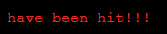

# Battleship game in Python

I created this battleship game in Python, it runs in a custom mock terminal designed by Code Institute.

The game is hosted on Heroku

[Here is the live version of my project](https://bat-ship.herokuapp.com/)

## How to play

I designed my battleship game on the classic version, I brushed up on the rules on [Wikipedia](https://en.wikipedia.org/wiki/Battleship).

In my version the computer board is randomly generated and the user of the website gets to place their own ships on the battlefield.
The ship locations are marked by an @ sign, guesses/misses are marked with a O and hits are marked with a X.
The player and the computer take it in turn to guess locations of the ships until either side has hit all of the opponents ships.

## Features

### Battleship load screen

* Shows to user when game has loaded.

### Rules screen

* Rules are typed out to user of the website 
* Pauses before clearing to give user time to read the rules.

### Name screen

* Asks the user for their Name.
* Store the name in memory and uses it to reply to the user.
* Personalises the game to the user.
* Asks the user if they want to play.
* If user says yes then onto placing ships.
* If user replies no then onto a goodbye screen.

### Place ships screen

* Asks the user to place their ships.
* If incorrect input then the user is alerted and asked to re-input the selection.
* Ships marked with an @ sign.

### Aiming at enemy ships 

* The user gets to pick where to aim their shots.
* Misses marked with O.
* Hits marked with X.
* Feedback given if shots hits or missed.

### Game over screens

* When all ships are sunk a win or lose screen appears.
* User will be asked if they want to play again.

## Flow plan

To assist me with what I wanted to achieve with my battleship game I created a flow chart using [Lucid](https://www.lucidchart.com/pages/landing?utm_source=google&utm_medium=cpc&utm_campaign=_chart_en_tier1_mixed_search_brand_exact_&km_CPC_CampaignId=1490375427&km_CPC_AdGroupID=55688909257&km_CPC_Keyword=lucidcharts&km_CPC_MatchType=e&km_CPC_ExtensionID=&km_CPC_Network=g&km_CPC_AdPosition=&km_CPC_Creative=442433236001&km_CPC_TargetID=kwd-84176206937&km_CPC_Country=1007337&km_CPC_Device=c&km_CPC_placement=&km_CPC_target=&gclid=CjwKCAiAjs2bBhACEiwALTBWZRqAG3YiNsaENhFAdTot-tJ7K4P2xmLjOIR9O3tJKetX73irjBXQNBoCe5UQAvD_BwE)
. This helped me to visualize what I wanted my game to encompass before I started to write code.

## Testing

I tested my code throughout this project by:

* Testing individual functions to ensure they worked.
* Using Pep8 within my gitpod workspace.
* Playing through my game and entering incorrect inputs.
* Tested within my local terminal and the Code Institute Heroku terminal on Heroku platform.

## Bugs

### Solved bugs

* When I was writing the code I was getting errors on my place_ship function. I fixed this by correcting the if/else statement within the while loop.
* I kept my functions to as as small as possible so any errors could be fixed quickly.

### Remaining bugs

* To the best of my knowledge and through extensive testing no bugs are remainig.

## Validator testing

* PEP8 within the gitpod terminal shows no errors remaining.
* CI Python linter shows no errors as well.

## Deployment

* Steps for deployment
  * Fork or clone this repository
  * Create a new Heroku app
  * Set the build packs to Python and NodeJs in that order
  * Link the Heroku app to the repository
  * Click on Deploy

## Credits

* Code Institute for the deployment terminal 
* Wikipedia for details on the battleships game
* When runnign into problems I used
  * The Code Institute slack channel
  * [Stack Overflow](https://stackoverflow.com/)
  * I also googled for solutions as well

## Acknowledgements

I would like to thank my mentor Victor Miclovich who has given me great advice and is very clear in explaining processes. I would also like to thank the Code Institute Slack community who are always ready to help if needed. Also the code institute slack community who are great and there is always someone ready to help if you are stuck or just to pick you up if you're feeling under the pressure.